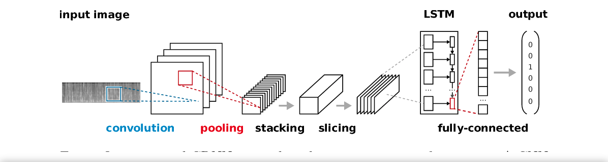
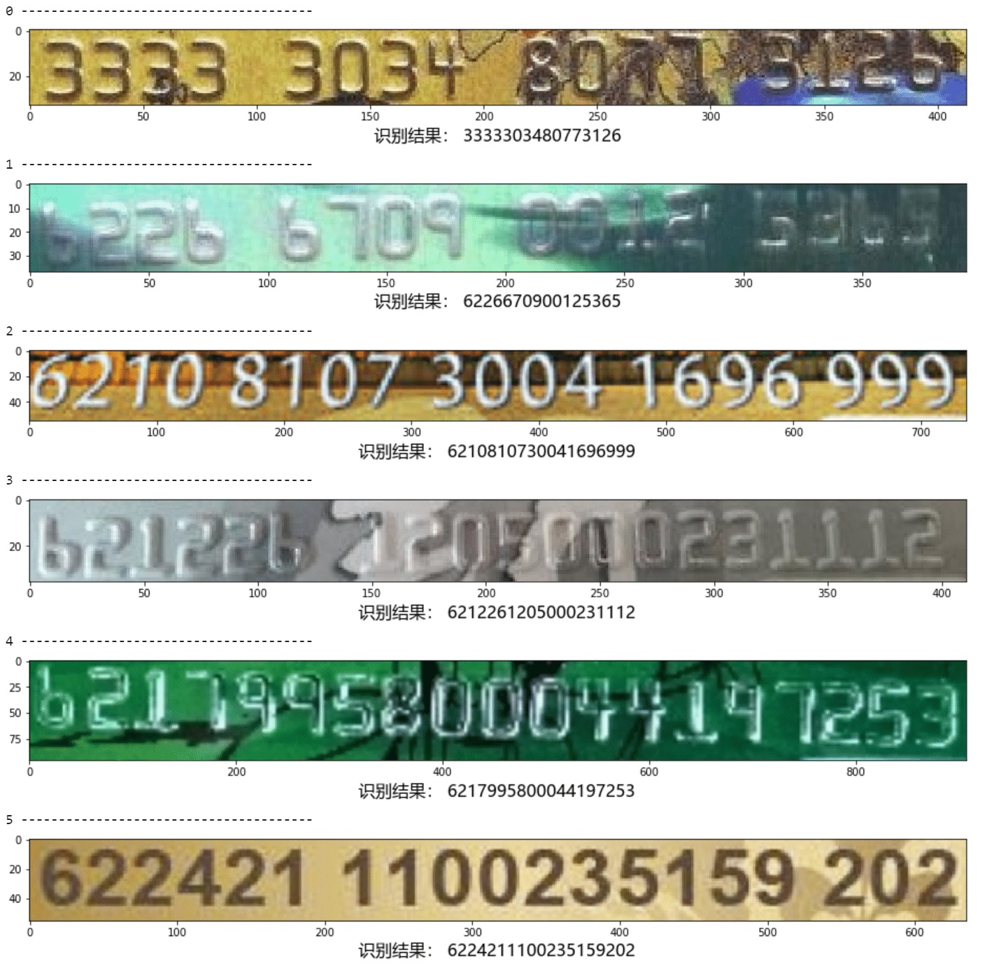
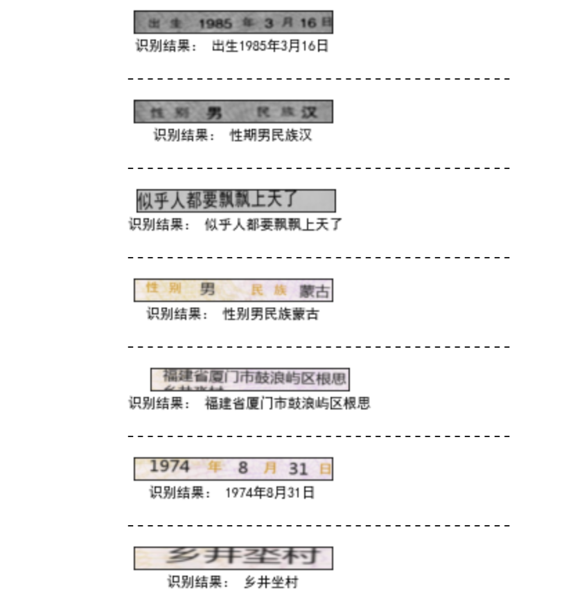

English | [简体中文](readme_ch.md)

## Introduction

A crnn project based on Tensorflow2.



## Demo

### digit



### chinese

 

## Features

1. Refactoring.

## Requirements

- Python 3.6+
- Tensorflow 2.2.0+

## Recent updates

**`2020-10-13`**: The first version is online.
**`2021-3-6`**: Open source data [construction tools](https://github.com/lvjianjin/TextRecognitionDataGenerator) 。

## Contents

- [Installation](#Installation)
    - [python](#python)
    - [docker](#docker)
- [Usage](#Usage)
    - [train](#train)
    - [test](#test)
    
## Installation

### python

Install the required Python packages,
```
pip install -r requirements.txt
```
### docker

## Usage

### train

1. Pull code

```
git clone https://github.com/lvjianjin/crnn.git
```
2. Prepare the data set

#### digit dataset

Generate simulation data through [this tool](https://github.com/lvjianjin/TextRecognitionDataGenerator), and modify the local dataset path to dataset_path in ./configs/config.py.

#### chinese dataset

Generate simulation data through [this tool](https://github.com/lvjianjin/TextRecognitionDataGenerator) or download the following Chinese data set to the local, and modify the local data set path to dataset_path in ./configs/config.py.
```
链接：https://pan.baidu.com/s/1FgdITVrM_HsyNh7QSpePjw 
提取码：iakr
解压密码:chineseocr
```
3. training

执行训练代码,
```
python main.py -m train
```

### test

Execute training code,
```
python main.py -m test
```

## Pre-trained model

The pre-trained model will be released soon, so stay tuned.

## Contact

1. e-mail：jianjinlv@163.com
2. QQ Group：1081332609

## License

The codes are released under the MIT License.