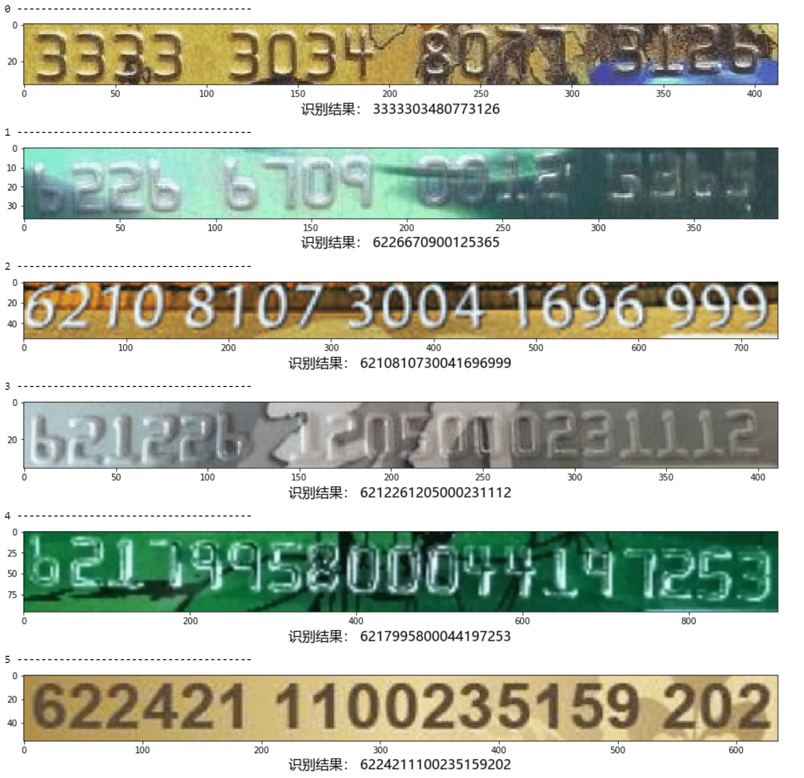
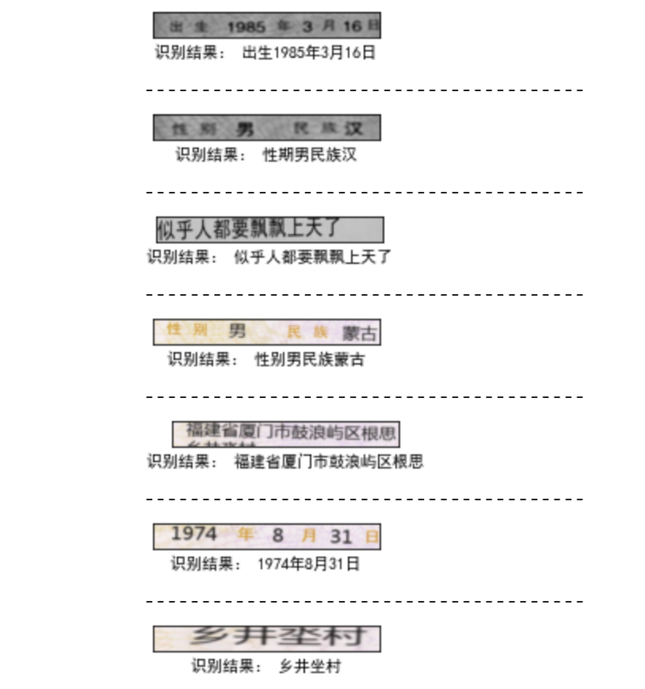

[English](readme.md) | 简体中文

## 介绍

一个基于Tensorflow2开发的crnn项目。


## 示例

### 数字



### 中文

 

## 特性

1. 支持数字识别。
2. 支持中文识别。

## 必要条件

- Python 3.6+
- Tensorflow 2.2.0+

## 近期更新

**`2021-2-20`**: 代码重构。

**`2021-3-6`**: 开源数据集[构造工具](https://github.com/lvjianjin/TextRecognitionDataGenerator) 。

**`2021-3-22`**: 稳定版本上线。

**`2021-4-14`**: 与训练模型对外开放。

## 内容

- [安装](#安装)
    - [python](#python)
- [使用](#使用)
    - [训练](#训练)
    - [测试](#测试)
    
## 安装

### python

安装所需Python包,
```
pip install -r requirements.txt
```

## 使用

### 训练
1. 拉取项目代码

```
git clone https://github.com/lvjianjin/crnn.git
```
2. 准备数据集

#### 数字数据集

通过[此工具](https://github.com/lvjianjin/TextRecognitionDataGenerator) 生成模拟数据，并将本地数据集路径修改至./configs/config.py中的dataset_path。

#### 中文数据集

通过[此工具](https://github.com/lvjianjin/TextRecognitionDataGenerator) 生成模拟数据或下载下述中文数据集至本地，并将本地数据集路径修改至./configs/config.py中的dataset_path。
```
链接：https://pan.baidu.com/s/1FgdITVrM_HsyNh7QSpePjw 
提取码：iakr
解压密码:chineseocr
```

3. 训练

执行训练代码,
```
python main.py -m train
```
查看tensorboard的命令如下，
```commandline
tensorboard --logdir=/home/lvjianjin/python-project/crnn/logs/date/20210330-144211 --host 192.168.46.230 --port 8006
```

### 测试

启动jupyter，执行./tests/demo.ipynb文件。

##预训练模型

### 模型结果文件

```commandline
链接：https://pan.baidu.com/s/1rH__qsTwEUJZ4zc6gx_zjg 
提取码：bcy0
```

### tensorflow-serving部署文件

```commandline
链接：https://pan.baidu.com/s/1hpeRbvO_dY5vt0AOmUX8Hg 
提取码：18n7 
```

## 联系

1. 邮箱：jianjinlv@163.com
2. QQ群：1081332609

## 许可证书

本项目的代码基于MIT协议发布。